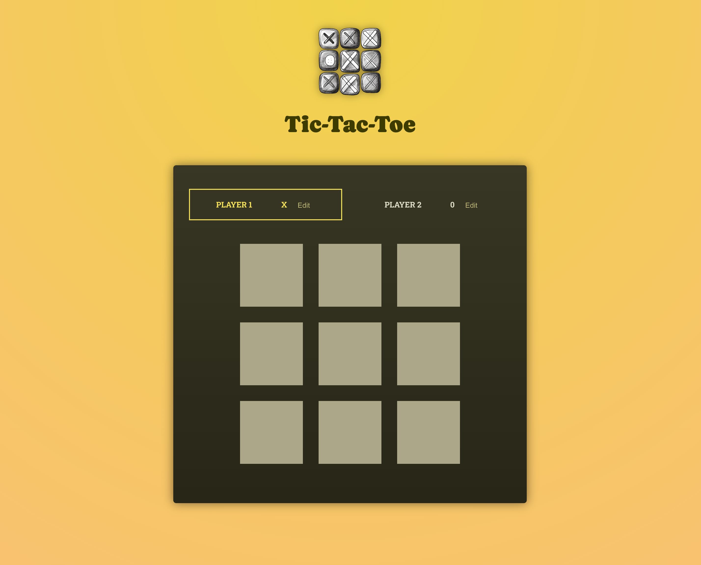

# 📝 Tic-Tac-Toe

### A simple project built as part of a Udemy course to practice React.

## 🚀 Features

[//]: # (- ✅ Feature 1)

[//]: # (- ✅ Feature 2)

[//]: # (- ✅ Feature 3  )

## 🛠️ Technologies Used

- React
- Vite

## 🏗️ How to Run the Project

1. Clone the repository:
   ```bash
   git clone https://github.com/halynabondar/Tic-Tac-Toe.git
   ```

2. Install dependencies:
   ```bash
   npm install
   ```

3.	Start the project:
   ```bash
   npm run dev
   ```

## Screenshots

